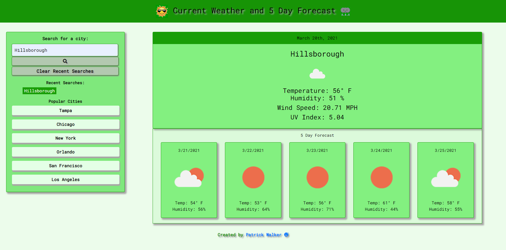

# Weather-Dashboard

# Weather Dashboard

### URL : https://pat31477.github.io/Weather-Dashboard/ [Deployed site]

### URL : https://github.com/pat31477/Weather-Dashboard [github repository site]

### Click link to open in your browser.

 
## Description
A weather dashboard that allows a user to view the current and 5 day weather in popular cities as well as cities of their choosing. The application runs in the browser and features dynamically updated HTML and CSS powered by jQuery,JS and 3rd party API's.

## Technology used
This application was built with HTML, CSS, BootStrap, JavaScript, JQuery, and Third Party API's

## User Story

```
AS A traveler
I WANT to see the weather outlook for multiple cities
SO THAT I can plan a trip accordingly
```

## Acceptance Criteria

```
GIVEN a weather dashboard with form inputs
WHEN I search for a city
THEN I am presented with current and future conditions for that city and that city is added to the search history
WHEN I view current weather conditions for that city
THEN I am presented with the city name, the date, an icon representation of weather conditions, the temperature, the humidity, the wind speed, and the UV index
WHEN I view the UV index
THEN I am presented with a color that indicates whether the conditions are favorable, moderate, or severe
WHEN I view future weather conditions for that city
THEN I am presented with a 5-day forecast that displays the date, an icon representation of weather conditions, the temperature, and the humidity
WHEN I click on a city in the search history
THEN I am again presented with current and future conditions for that city
```

## Usage
- This weather displays current weather and 5 day forecast.
- Temperature, humidity, wind speed and UV Index are all displayed.
- The user can search from prepopulated popular cities or for a city of their choosing.
- GeoLocation is also enabled. When the user clicks allow to the windows prompt to allow location, the current weather and 5 day forecast will be displayed for that location.
- The user can click the Clear Recent Searches button to clear the recently search cities and reload the application.

## Full Screen



## Acknowledgements:

Thank you to the following for their suggestions, insights, help, and keeping me focused on this assignment.

* Ben Durham (https://github.com/bdurham227)

* Gabe Thomas (https://github.com/samohtebag)

* Jason Barbanel (https://github.com/Jbarbss)

* Takuya Matsumoto (https://github.com/TakuyaMats)

## Licensing:

Copyright (c) 2021 Patrick E. Walker

Permission is hereby granted, free of charge, to any person obtaining
a copy of this software and associated documentation files (the
"Software"), to deal in the Software without restriction, including
without limitation the rights to use, copy, modify, merge, publish,
distribute, sublicense, and/or sell copies of the Software, and to
permit persons to whom the Software is furnished to do so, subject to
the following conditions:

The above copyright notice and this permission notice shall be
included in all copies or substantial portions of the Software.

THE SOFTWARE IS PROVIDED "AS IS", WITHOUT WARRANTY OF ANY KIND,
EXPRESS OR IMPLIED, INCLUDING BUT NOT LIMITED TO THE WARRANTIES OF
MERCHANTABILITY, FITNESS FOR A PARTICULAR PURPOSE AND
NONINFRINGEMENT. IN NO EVENT SHALL THE AUTHORS OR COPYRIGHT HOLDERS BE
LIABLE FOR ANY CLAIM, DAMAGES OR OTHER LIABILITY, WHETHER IN AN ACTION
OF CONTRACT, TORT OR OTHERWISE, ARISING FROM, OUT OF OR IN CONNECTION
WITH THE SOFTWARE OR THE USE OR OTHER DEALINGS IN THE SOFTWARE.